# WordPress Blueprints Gallery

Here's the list of all the community Blueprints submitted to this repository. See the [contribution guidelines](./README.md#contributing-your-blueprint) to submit your Blueprint and share your WordPress setup with the world!

<h2><strong>Art Gallery</strong></h2>

An art gallery created with the Vueo theme.

<small>By <a href="https://github.com/WordPress.com">@WordPress.com</a> • <a href="https://github.com/wordpress/blueprints/blob/trunk/blueprints/portfolio-vueo/blueprint.json">View source</a> • <a href="https://playground.wordpress.net/builder/builder.html?blueprint-url=https://raw.githubusercontent.com/wordpress/blueprints/1cb0a25b887ed9b7bfc983ee76cf0396dd2ba34d/blueprints/portfolio-vueo/blueprint.json">Edit</a></small>

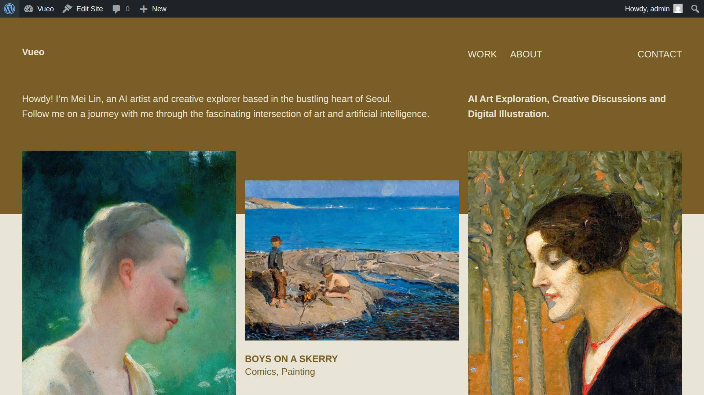

 

<h2><strong>Feed Reader with the Friends Plugin</strong></h2>

By using the Friends plugin, you can read feeds from the web in Playground, and even via ActivityPub

<small>By <a href="https://github.com/akirk">@akirk</a> • <a href="https://github.com/wordpress/blueprints/blob/trunk/blueprints/friends-cors/blueprint.json">View source</a> • <a href="https://playground.wordpress.net/builder/builder.html?blueprint-url=https://raw.githubusercontent.com/wordpress/blueprints/1cb0a25b887ed9b7bfc983ee76cf0396dd2ba34d/blueprints/friends-cors/blueprint.json">Edit</a></small>

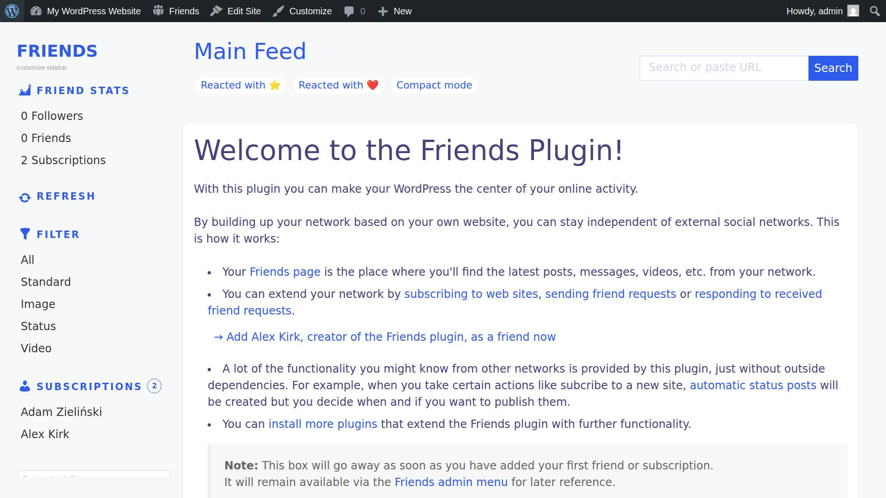

 

<h2><strong>Gaming News</strong></h2>

A gaming news site created with the Spiel theme.

<small>By <a href="https://github.com/WordPress.com">@WordPress.com</a> • <a href="https://github.com/wordpress/blueprints/blob/trunk/blueprints/news-spiel/blueprint.json">View source</a> • <a href="https://playground.wordpress.net/builder/builder.html?blueprint-url=https://raw.githubusercontent.com/wordpress/blueprints/1cb0a25b887ed9b7bfc983ee76cf0396dd2ba34d/blueprints/news-spiel/blueprint.json">Edit</a></small>

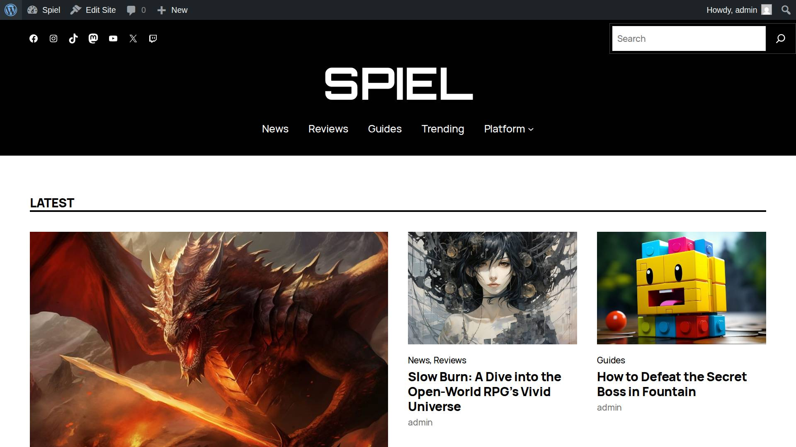

 

<h2><strong>Non-profit Organization</strong></h2>

A non-profit organization site created with the Koinonia theme.

<small>By <a href="https://github.com/WordPress.com">@WordPress.com</a> • <a href="https://github.com/wordpress/blueprints/blob/trunk/blueprints/organization-koinonia/blueprint.json">View source</a> • <a href="https://playground.wordpress.net/builder/builder.html?blueprint-url=https://raw.githubusercontent.com/wordpress/blueprints/1cb0a25b887ed9b7bfc983ee76cf0396dd2ba34d/blueprints/organization-koinonia/blueprint.json">Edit</a></small>

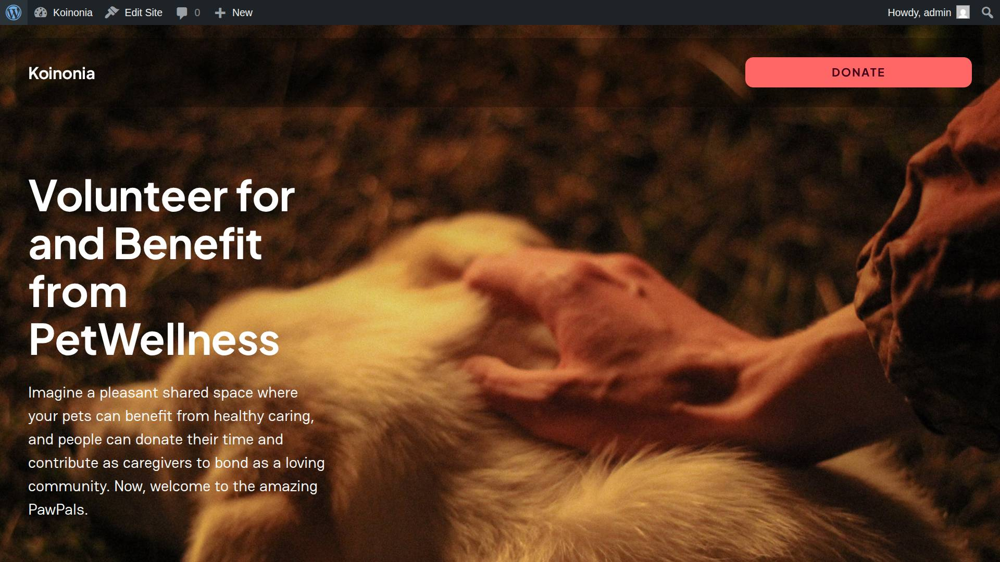

 

<h2><strong>Personal Blog</strong></h2>

A personal blog site created with the Substrata theme.

<small>By <a href="https://github.com/WordPress.com">@WordPress.com</a> • <a href="https://github.com/wordpress/blueprints/blob/trunk/blueprints/personal-substrata/blueprint.json">View source</a> • <a href="https://playground.wordpress.net/builder/builder.html?blueprint-url=https://raw.githubusercontent.com/wordpress/blueprints/1cb0a25b887ed9b7bfc983ee76cf0396dd2ba34d/blueprints/personal-substrata/blueprint.json">Edit</a></small>

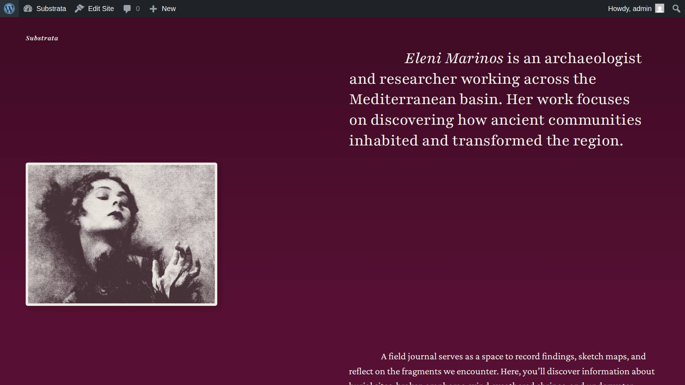

 

<h2><strong>Personal Resume</strong></h2>

A resume site created with the Readymade theme.

<small>By <a href="https://github.com/WordPress.com">@WordPress.com</a> • <a href="https://github.com/wordpress/blueprints/blob/trunk/blueprints/personal-readymade/blueprint.json">View source</a> • <a href="https://playground.wordpress.net/builder/builder.html?blueprint-url=https://raw.githubusercontent.com/wordpress/blueprints/1cb0a25b887ed9b7bfc983ee76cf0396dd2ba34d/blueprints/personal-readymade/blueprint.json">Edit</a></small>

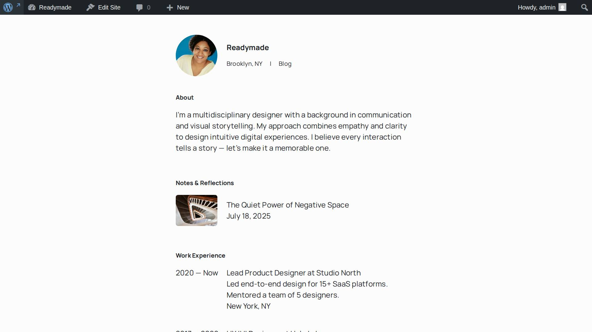

 

<h2><strong>Photography Portfolio</strong></h2>

A photography portfolio created with the Grammer theme.

<small>By <a href="https://github.com/WordPress.com">@WordPress.com</a> • <a href="https://github.com/wordpress/blueprints/blob/trunk/blueprints/portfolio-grammer/blueprint.json">View source</a> • <a href="https://playground.wordpress.net/builder/builder.html?blueprint-url=https://raw.githubusercontent.com/wordpress/blueprints/1cb0a25b887ed9b7bfc983ee76cf0396dd2ba34d/blueprints/portfolio-grammer/blueprint.json">Edit</a></small>

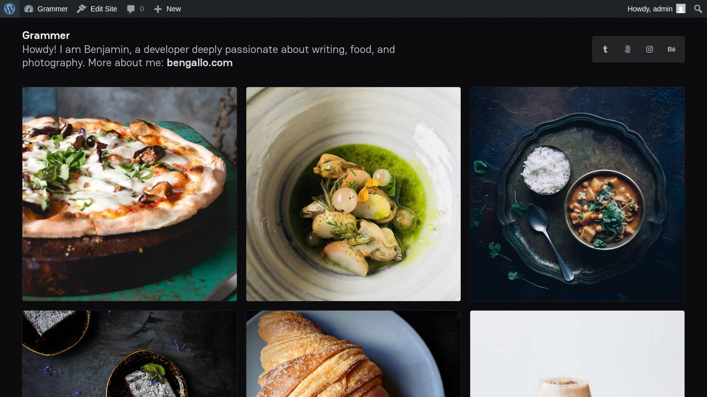

 

<h2><strong>Skincare Blog</strong></h2>

A skincare blog created with the Piel theme.

<small>By <a href="https://github.com/WordPress.com">@WordPress.com</a> • <a href="https://github.com/wordpress/blueprints/blob/trunk/blueprints/news-piel/blueprint.json">View source</a> • <a href="https://playground.wordpress.net/builder/builder.html?blueprint-url=https://raw.githubusercontent.com/wordpress/blueprints/1cb0a25b887ed9b7bfc983ee76cf0396dd2ba34d/blueprints/news-piel/blueprint.json">Edit</a></small>

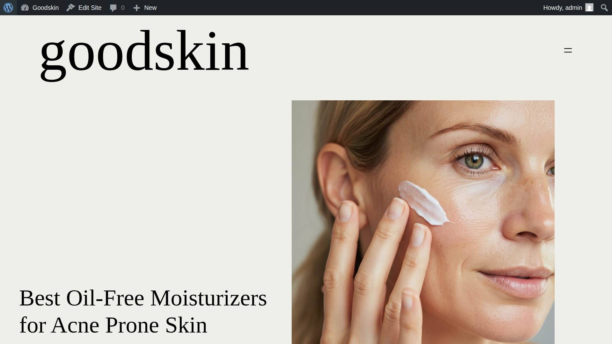

 

<h2><strong>Stylish Press</strong></h2>

A Woo store with custom theme, content, and products.

<small>By <a href="https://github.com/adamziel">@adamziel</a> • <a href="https://github.com/wordpress/blueprints/blob/trunk/blueprints/stylish-press/blueprint.json">View source</a> • <a href="https://playground.wordpress.net/builder/builder.html?blueprint-url=https://raw.githubusercontent.com/wordpress/blueprints/1cb0a25b887ed9b7bfc983ee76cf0396dd2ba34d/blueprints/stylish-press/blueprint.json">Edit</a></small>

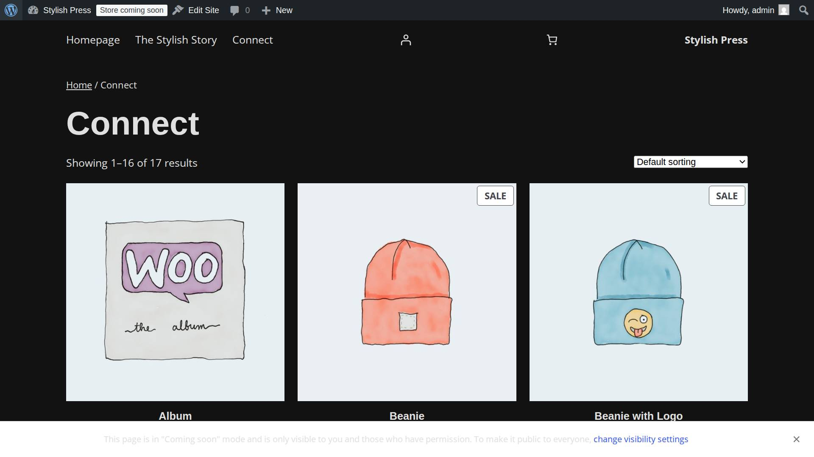

 

<h2><strong>University Website</strong></h2>

A university website created with the Kentwood theme.

<small>By <a href="https://github.com/WordPress.com">@WordPress.com</a> • <a href="https://github.com/wordpress/blueprints/blob/trunk/blueprints/organization-kentwood/blueprint.json">View source</a> • <a href="https://playground.wordpress.net/builder/builder.html?blueprint-url=https://raw.githubusercontent.com/wordpress/blueprints/1cb0a25b887ed9b7bfc983ee76cf0396dd2ba34d/blueprints/organization-kentwood/blueprint.json">Edit</a></small>

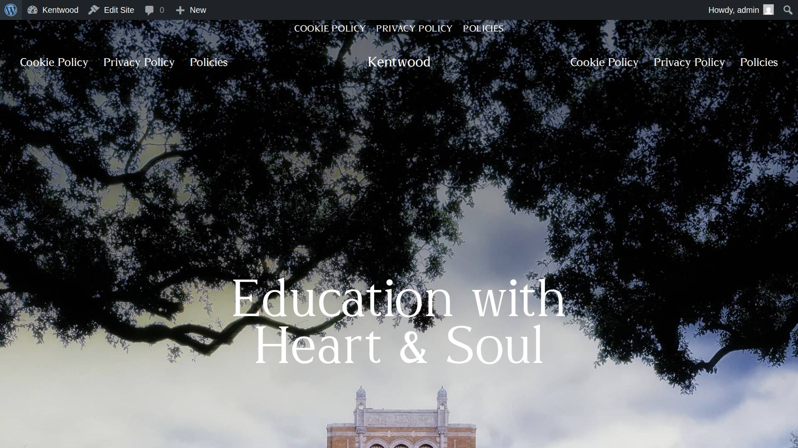

 

<h2>Create Block Theme</h2>

Blueprint to install Create Block Theme and start editing right away

<small>By <a href="https://github.com/jonathanbossenger">@jonathanbossenger</a> • <a href="https://github.com/wordpress/blueprints/blob/trunk/blueprints/create-block-theme/blueprint.json">View source</a> • <a href="https://playground.wordpress.net/builder/builder.html?blueprint-url=https://raw.githubusercontent.com/wordpress/blueprints/1cb0a25b887ed9b7bfc983ee76cf0396dd2ba34d/blueprints/create-block-theme/blueprint.json">Edit</a></small>

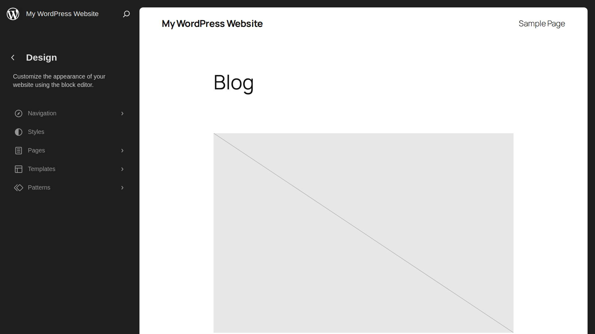

 

<h2>Creating a new user for the blog</h2>

This is a simple example to update user meta data

<small>By <a href="https://github.com/fellyph">@fellyph</a> • <a href="https://github.com/wordpress/blueprints/blob/trunk/blueprints/user-meta/blueprint.json">View source</a> • <a href="https://playground.wordpress.net/builder/builder.html?blueprint-url=https://raw.githubusercontent.com/wordpress/blueprints/1cb0a25b887ed9b7bfc983ee76cf0396dd2ba34d/blueprints/user-meta/blueprint.json">Edit</a></small>

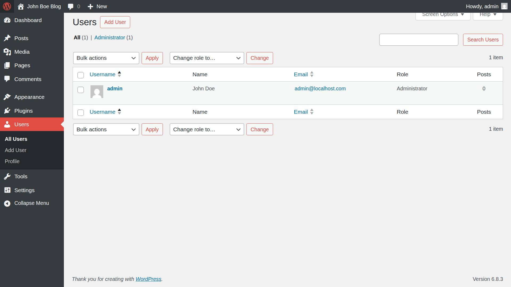

 

<h2>Custom Post Type: Books</h2>

Blueprint that added a custom post type to playground

<small>By <a href="https://github.com/bph">@bph</a> • <a href="https://github.com/wordpress/blueprints/blob/trunk/blueprints/custom-post/blueprint.json">View source</a> • <a href="https://playground.wordpress.net/builder/builder.html?blueprint-url=https://raw.githubusercontent.com/wordpress/blueprints/1cb0a25b887ed9b7bfc983ee76cf0396dd2ba34d/blueprints/custom-post/blueprint.json">Edit</a></small>

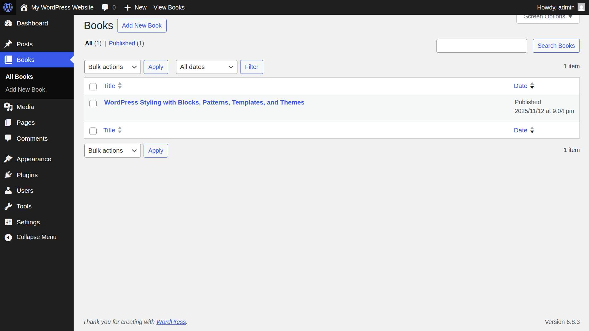

 

<h2>Demo of Twenty-Twenty-Five theme</h2>

Blueprint with demo content for the Twenty-Twenty-Five default theme

<small>By <a href="https://github.com/bph">@bph</a> • <a href="https://github.com/wordpress/blueprints/blob/trunk/blueprints/tt5-demo/blueprint.json">View source</a> • <a href="https://playground.wordpress.net/builder/builder.html?blueprint-url=https://raw.githubusercontent.com/wordpress/blueprints/1cb0a25b887ed9b7bfc983ee76cf0396dd2ba34d/blueprints/tt5-demo/blueprint.json">Edit</a></small>

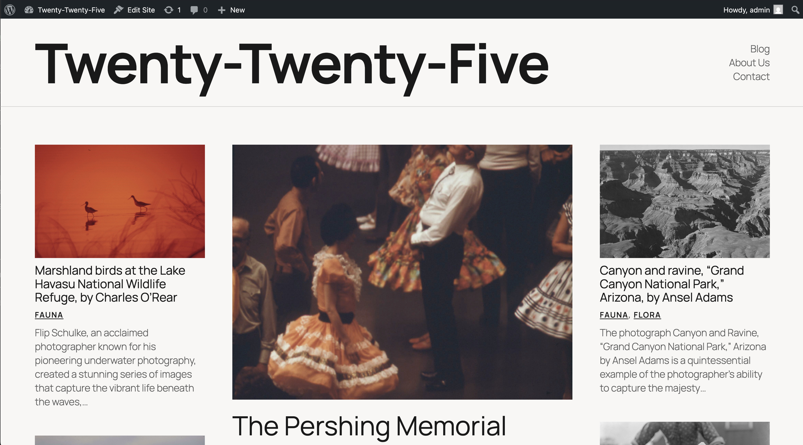

 

<h2>Display Admin Notice </h2>

Blueprint to add a tiny mu-plugin and display an admin notice

<small>By <a href="https://github.com/bph">@bph</a> • <a href="https://github.com/wordpress/blueprints/blob/trunk/blueprints/admin-notice/blueprint.json">View source</a> • <a href="https://playground.wordpress.net/builder/builder.html?blueprint-url=https://raw.githubusercontent.com/wordpress/blueprints/1cb0a25b887ed9b7bfc983ee76cf0396dd2ba34d/blueprints/admin-notice/blueprint.json">Edit</a></small>

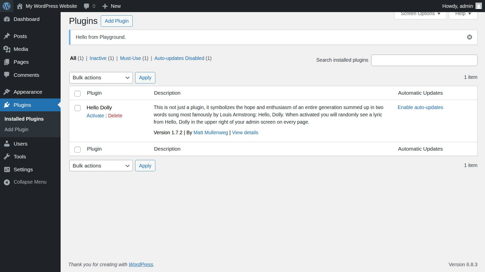

 

<h2>Enable all three Dataview Experiments in Gutenberg</h2>

Blueprint example to enable multiple Experiments within the Gutenberg plugin 

<small>By <a href="https://github.com/bph">@bph</a> • <a href="https://github.com/wordpress/blueprints/blob/trunk/blueprints/gb-more-experiments/blueprint.json">View source</a> • <a href="https://playground.wordpress.net/builder/builder.html?blueprint-url=https://raw.githubusercontent.com/wordpress/blueprints/1cb0a25b887ed9b7bfc983ee76cf0396dd2ba34d/blueprints/gb-more-experiments/blueprint.json">Edit</a></small>

 

<h2>Fancy Dashboard Widget</h2>

A blueprint to display statistics about users, posts and comments on a WordPress site.

<small>By <a href="https://github.com/muryamsultana">@muryamsultana</a> • <a href="https://github.com/wordpress/blueprints/blob/trunk/blueprints/fancy-dashboard_widget/blueprint.json">View source</a> • <a href="https://playground.wordpress.net/builder/builder.html?blueprint-url=https://raw.githubusercontent.com/wordpress/blueprints/1cb0a25b887ed9b7bfc983ee76cf0396dd2ba34d/blueprints/fancy-dashboard_widget/blueprint.json">Edit</a></small>

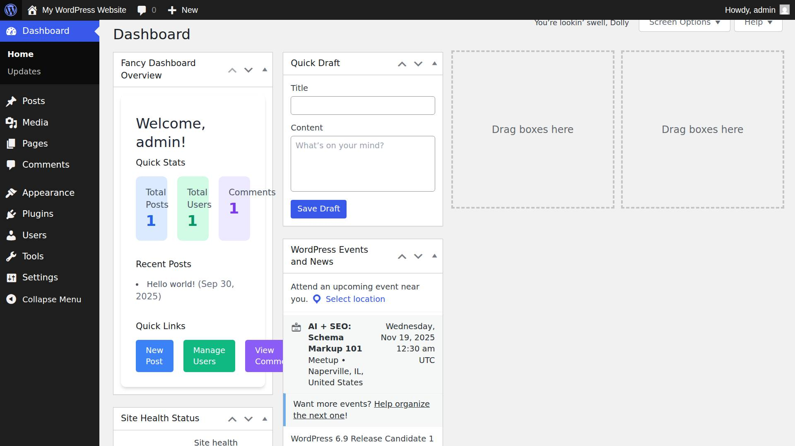

 

<h2>Grid Variations Experiments enabled</h2>

Blueprint example to toggle on enable a feature from the Experiments page in Gutenberg plugin

<small>By <a href="https://github.com/bph">@bph</a> • <a href="https://github.com/wordpress/blueprints/blob/trunk/blueprints/grid-variations/blueprint.json">View source</a> • <a href="https://playground.wordpress.net/builder/builder.html?blueprint-url=https://raw.githubusercontent.com/wordpress/blueprints/1cb0a25b887ed9b7bfc983ee76cf0396dd2ba34d/blueprints/grid-variations/blueprint.json">Edit</a></small>

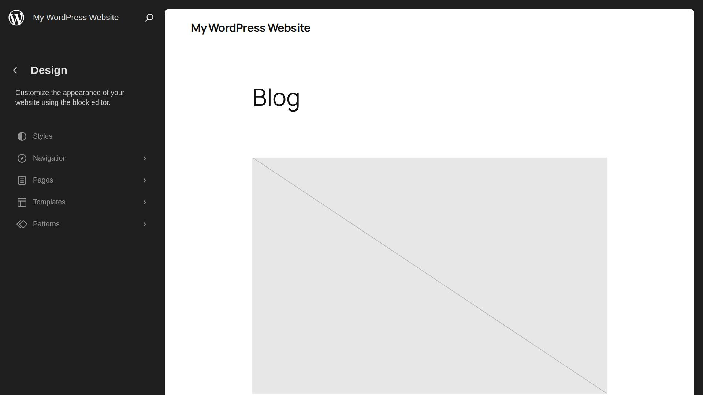

 

<h2>Import Theme Starter Content</h2>

Blueprint to install a theme with starter content, (here: Twenty-Twenty-One)

<small>By <a href="https://github.com/bph">@bph</a> • <a href="https://github.com/wordpress/blueprints/blob/trunk/blueprints/theme-starter-content/blueprint.json">View source</a> • <a href="https://playground.wordpress.net/builder/builder.html?blueprint-url=https://raw.githubusercontent.com/wordpress/blueprints/1cb0a25b887ed9b7bfc983ee76cf0396dd2ba34d/blueprints/theme-starter-content/blueprint.json">Edit</a></small>

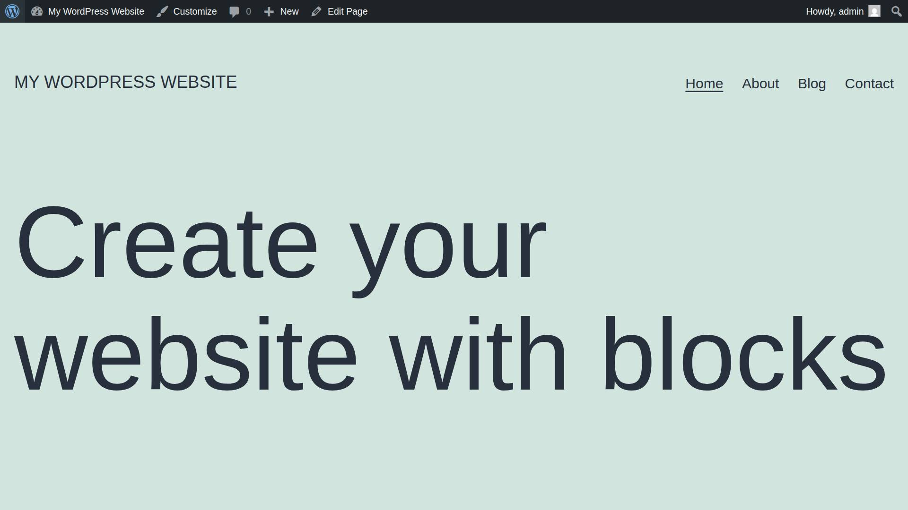

 

<h2>Import a standalone starter content via a blueprint step</h2>

Blueprint to use a stand-alone starter content file and then to import it. Click on 'Subscriptions'

<small>By <a href="https://github.com/bph">@bph</a> • <a href="https://github.com/wordpress/blueprints/blob/trunk/blueprints/file-starter-content/blueprint.json">View source</a> • <a href="https://playground.wordpress.net/builder/builder.html?blueprint-url=https://raw.githubusercontent.com/wordpress/blueprints/1cb0a25b887ed9b7bfc983ee76cf0396dd2ba34d/blueprints/file-starter-content/blueprint.json">Edit</a></small>

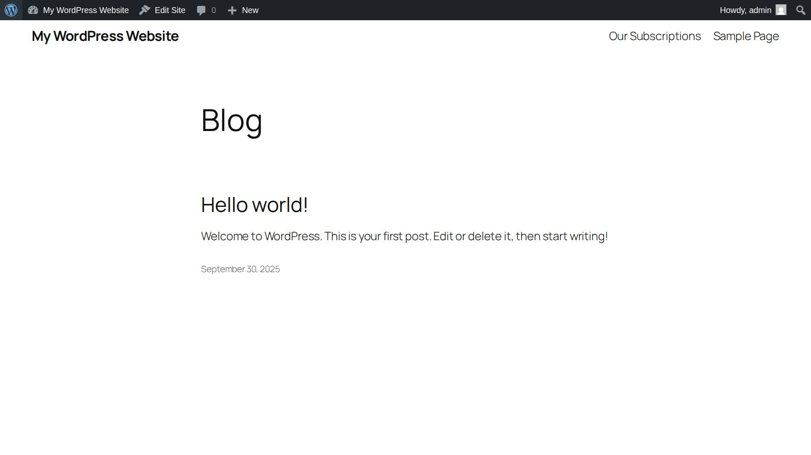

 

<h2>Install WordPress language packs</h2>

Installs and activates the latest WordPress Japanese translation pack from https://translate.wordpress.org/ – both for WordPress core and for the friends plugin.

<small>By <a href="https://github.com/adamziel">@adamziel</a> • <a href="https://github.com/wordpress/blueprints/blob/trunk/blueprints/translations/blueprint.json">View source</a> • <a href="https://playground.wordpress.net/builder/builder.html?blueprint-url=https://raw.githubusercontent.com/wordpress/blueprints/1cb0a25b887ed9b7bfc983ee76cf0396dd2ba34d/blueprints/translations/blueprint.json">Edit</a></small>

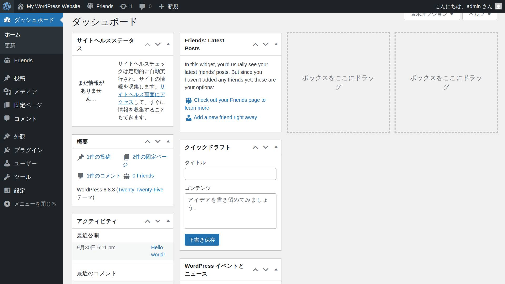

 

<h2>Install plugin from a gist</h2>

Install and activate a WordPress plugin from a .php file stored in a gist.

<small>By <a href="https://github.com/zieladam">@zieladam</a> • <a href="https://github.com/wordpress/blueprints/blob/trunk/blueprints/install-plugin-from-gist/blueprint.json">View source</a> • <a href="https://playground.wordpress.net/builder/builder.html?blueprint-url=https://raw.githubusercontent.com/wordpress/blueprints/1cb0a25b887ed9b7bfc983ee76cf0396dd2ba34d/blueprints/install-plugin-from-gist/blueprint.json">Edit</a></small>

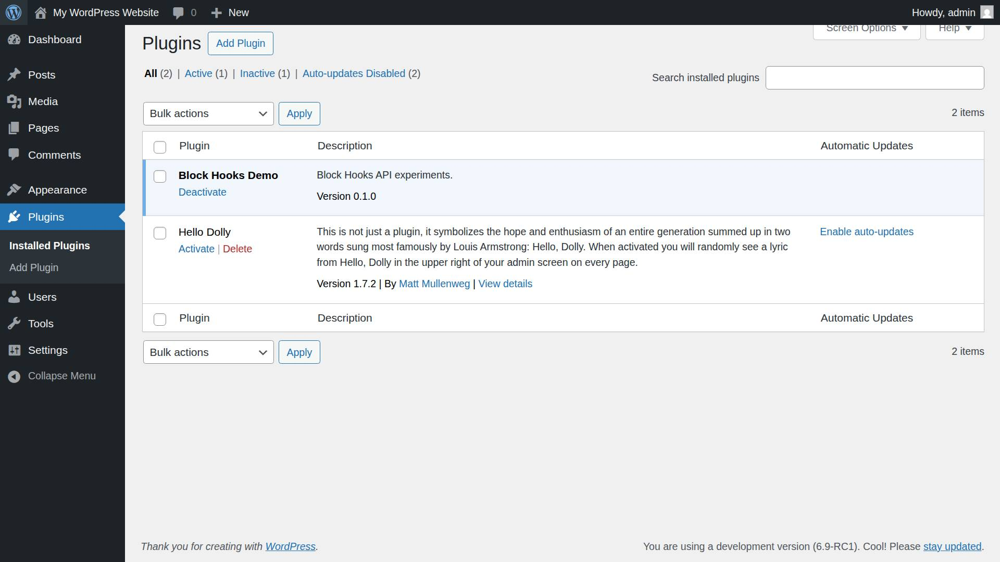

 

<h2>Latest Gutenberg plugin</h2>

A preview of the latest version of the Gutenberg plugin.

<small>By <a href="https://github.com/zieladam">@zieladam</a> • <a href="https://github.com/wordpress/blueprints/blob/trunk/blueprints/latest-gutenberg/blueprint.json">View source</a> • <a href="https://playground.wordpress.net/builder/builder.html?blueprint-url=https://raw.githubusercontent.com/wordpress/blueprints/1cb0a25b887ed9b7bfc983ee76cf0396dd2ba34d/blueprints/latest-gutenberg/blueprint.json">Edit</a></small>

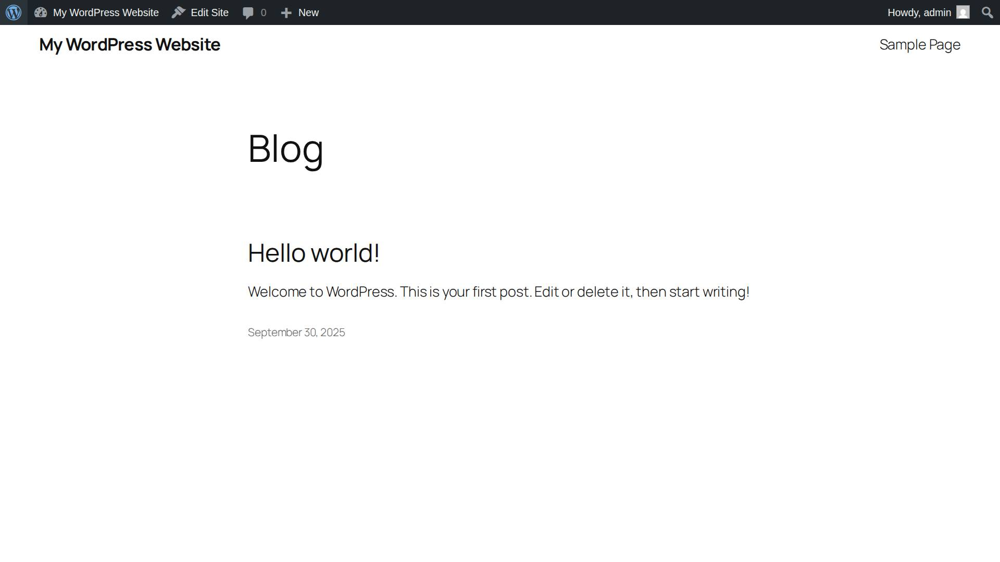

 

<h2>Loading, activating, and configuring a theme from a GitHub repository.</h2>

This is a good example of typical steps used on a theme's loading, activation and configuration

<small>By <a href="https://github.com/richtabor">@richtabor</a> • <a href="https://github.com/wordpress/blueprints/blob/trunk/blueprints/install-activate-setup-theme-from-gh-repo/blueprint.json">View source</a> • <a href="https://playground.wordpress.net/builder/builder.html?blueprint-url=https://raw.githubusercontent.com/wordpress/blueprints/1cb0a25b887ed9b7bfc983ee76cf0396dd2ba34d/blueprints/install-activate-setup-theme-from-gh-repo/blueprint.json">Edit</a></small>

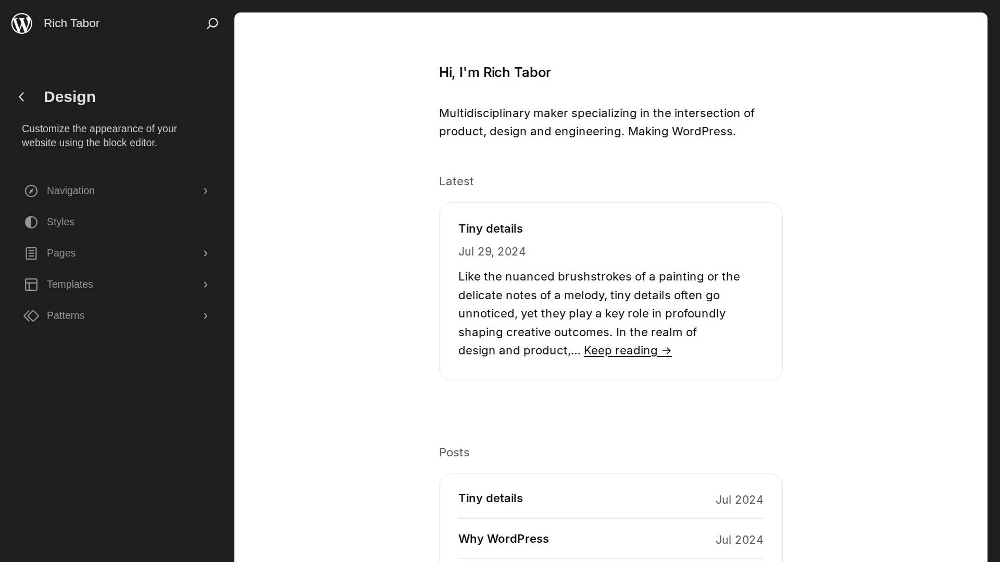

 

<h2>Login as an editor</h2>

Test WordPress functionality as an editor rather than an administrator.

<small>By <a href="https://github.com/bacoords">@bacoords</a> • <a href="https://github.com/wordpress/blueprints/blob/trunk/blueprints/login-as-editor/blueprint.json">View source</a> • <a href="https://playground.wordpress.net/builder/builder.html?blueprint-url=https://raw.githubusercontent.com/wordpress/blueprints/1cb0a25b887ed9b7bfc983ee76cf0396dd2ba34d/blueprints/login-as-editor/blueprint.json">Edit</a></small>

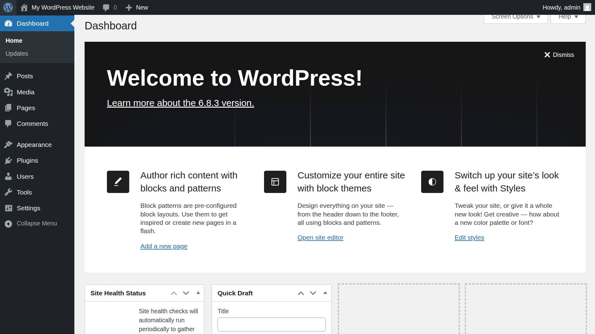

 

<h2>Markdown and Trac Syntax Editor</h2>

Edit Markdown and Trac formatting in the block editor thanks to the blocky-formats plugin!

<small>By <a href="https://github.com/adamziel">@adamziel</a> • <a href="https://github.com/wordpress/blueprints/blob/trunk/blueprints/blocky-formats/blueprint.json">View source</a> • <a href="https://playground.wordpress.net/builder/builder.html?blueprint-url=https://raw.githubusercontent.com/wordpress/blueprints/1cb0a25b887ed9b7bfc983ee76cf0396dd2ba34d/blueprints/blocky-formats/blueprint.json">Edit</a></small>

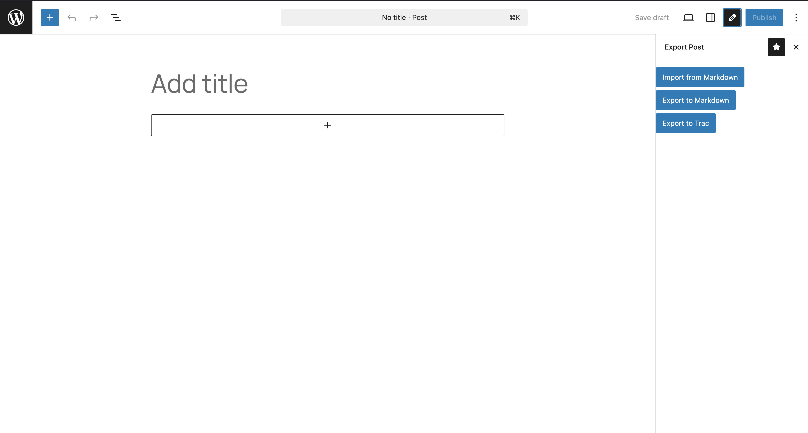

 

<h2>Minimal WooCommerce Setup with Sample Products, Shipping, and Payment Method</h2>

To create a WordPress Playground instance that installs WooCommerce, adds a custom flat rate shipping method via a plugin, imports WooCommerce sample products XML to demonstrate the shipping method on the cart/checkout pages, and enables the Direct Bank Transfer payment method.

<small>By <a href="https://github.com/calvinrodrigues500">@calvinrodrigues500</a> • <a href="https://github.com/wordpress/blueprints/blob/trunk/blueprints/woo-shipping/blueprint.json">View source</a> • <a href="https://playground.wordpress.net/builder/builder.html?blueprint-url=https://raw.githubusercontent.com/wordpress/blueprints/1cb0a25b887ed9b7bfc983ee76cf0396dd2ba34d/blueprints/woo-shipping/blueprint.json">Edit</a></small>

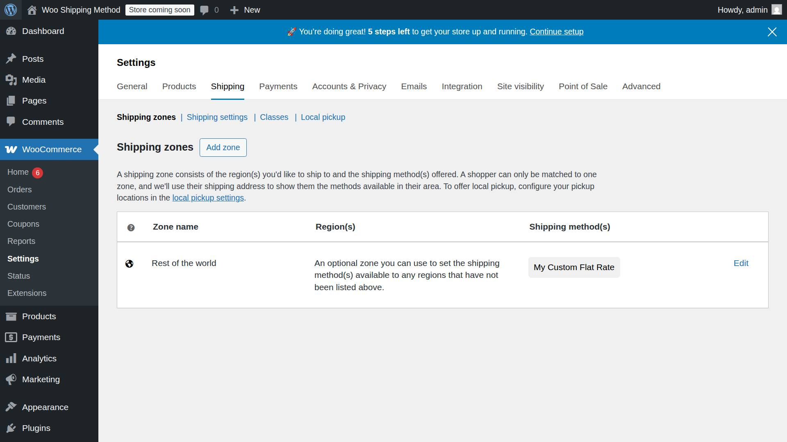

 

<h2>Playground Welcome Landing Page</h2>

Landing page for the WordPress Playground giving a quick overview of the features and capabilities of the platform.

<small>By <a href="https://github.com/fellyph">@fellyph</a> • <a href="https://github.com/wordpress/blueprints/blob/trunk/blueprints/welcome/blueprint.json">View source</a> • <a href="https://playground.wordpress.net/builder/builder.html?blueprint-url=https://raw.githubusercontent.com/wordpress/blueprints/1cb0a25b887ed9b7bfc983ee76cf0396dd2ba34d/blueprints/welcome/blueprint.json">Edit</a></small>

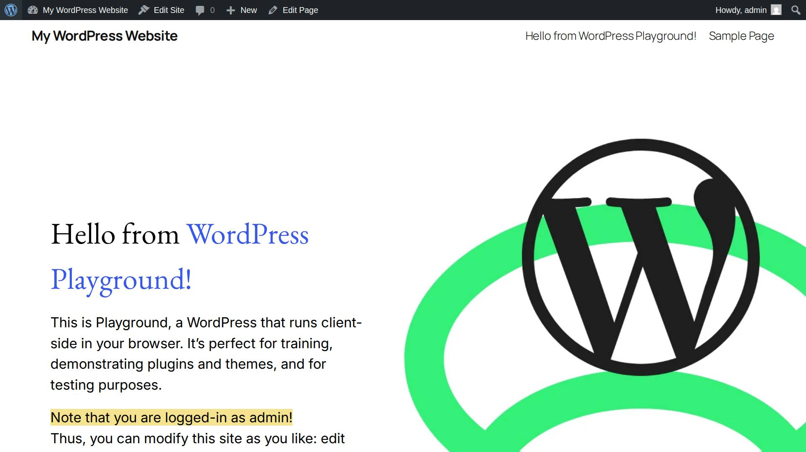

 

<h2>Pretty permalinks</h2>

Set the permalink structure to use pretty permalinks.

<small>By <a href="https://github.com/bgrgicak">@bgrgicak</a> • <a href="https://github.com/wordpress/blueprints/blob/trunk/blueprints/use-pretty-permalinks/blueprint.json">View source</a> • <a href="https://playground.wordpress.net/builder/builder.html?blueprint-url=https://raw.githubusercontent.com/wordpress/blueprints/1cb0a25b887ed9b7bfc983ee76cf0396dd2ba34d/blueprints/use-pretty-permalinks/blueprint.json">Edit</a></small>

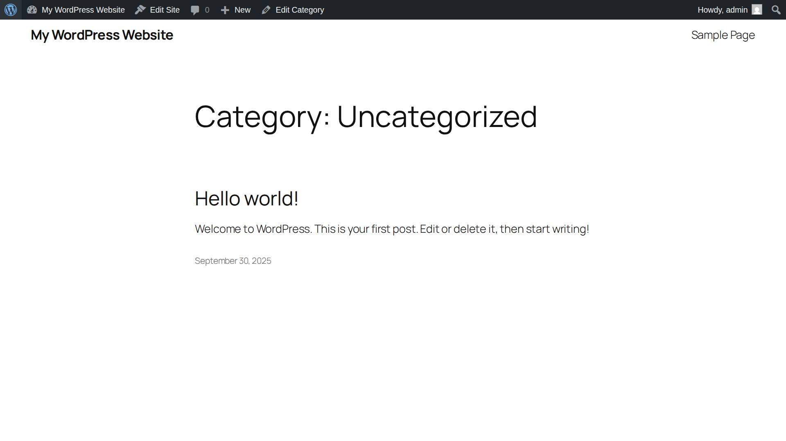

 

<h2>Reset data and import content (with logs)</h2>

It resets default data before importing custom content. It also logs the state of the content after each step.

<small>By <a href="https://github.com/juanmaguitar">@juanmaguitar</a> • <a href="https://github.com/wordpress/blueprints/blob/trunk/blueprints/reset-data-and-import-content/blueprint.json">View source</a> • <a href="https://playground.wordpress.net/builder/builder.html?blueprint-url=https://raw.githubusercontent.com/wordpress/blueprints/1cb0a25b887ed9b7bfc983ee76cf0396dd2ba34d/blueprints/reset-data-and-import-content/blueprint.json">Edit</a></small>

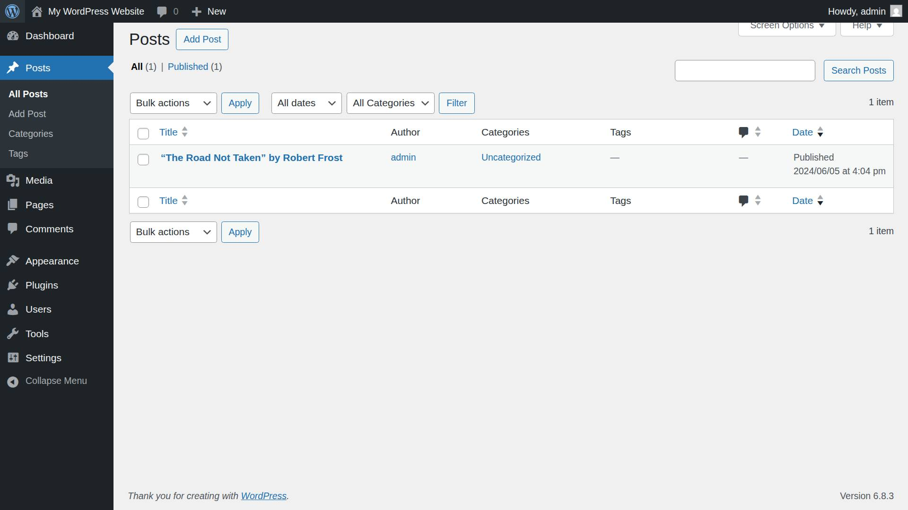

 

<h2>Serve media files from another host</h2>

Redirect any requests to files within the uploads directory to an external host. This is useful when you have a lot of image attachments in your playground but don’t want to include them all in the blueprint.

<small>By <a href="https://github.com/ivanblagdan">@ivanblagdan</a> • <a href="https://github.com/wordpress/blueprints/blob/trunk/blueprints/redirect-upload-requests/blueprint.json">View source</a> • <a href="https://playground.wordpress.net/builder/builder.html?blueprint-url=https://raw.githubusercontent.com/wordpress/blueprints/1cb0a25b887ed9b7bfc983ee76cf0396dd2ba34d/blueprints/redirect-upload-requests/blueprint.json">Edit</a></small>

 

<h2>Set the admin color scheme</h2>

Set the admin color scheme to Modern using the updateUserMeta step.

<small>By <a href="https://github.com/ndiego">@ndiego</a> • <a href="https://github.com/wordpress/blueprints/blob/trunk/blueprints/set-admin-color-scheme/blueprint.json">View source</a> • <a href="https://playground.wordpress.net/builder/builder.html?blueprint-url=https://raw.githubusercontent.com/wordpress/blueprints/1cb0a25b887ed9b7bfc983ee76cf0396dd2ba34d/blueprints/set-admin-color-scheme/blueprint.json">Edit</a></small>

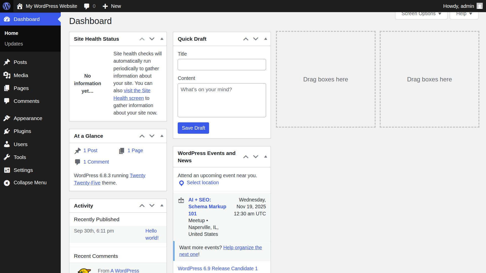

 

<h2>Showcase plugin</h2>

Showcase custom plugin from own server with media files and content imported as WXR. There is a readme file in github repository (https://github.com/Lovor01/blueprints/blob/trunk/blueprints/showcase-plugin-with-media/readme.md) which explains all steps.

<small>By <a href="https://github.com/Lovor01">@Lovor01</a> • <a href="https://github.com/wordpress/blueprints/blob/trunk/blueprints/showcase-plugin-with-media/blueprint.json">View source</a> • <a href="https://playground.wordpress.net/builder/builder.html?blueprint-url=https://raw.githubusercontent.com/wordpress/blueprints/1cb0a25b887ed9b7bfc983ee76cf0396dd2ba34d/blueprints/showcase-plugin-with-media/blueprint.json">Edit</a></small>

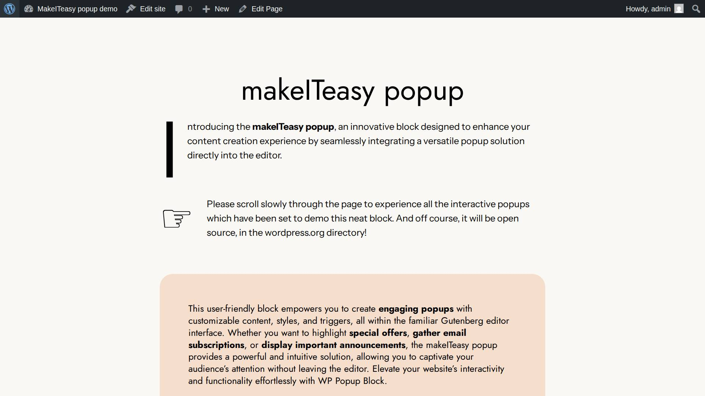

 

<h2>Theme Tester</h2>

Blueprint example to add content and plugins to explore a theme

<small>By <a href="https://github.com/bph">@bph</a> • <a href="https://github.com/wordpress/blueprints/blob/trunk/blueprints/theme-a11y-test/blueprint.json">View source</a> • <a href="https://playground.wordpress.net/builder/builder.html?blueprint-url=https://raw.githubusercontent.com/wordpress/blueprints/1cb0a25b887ed9b7bfc983ee76cf0396dd2ba34d/blueprints/theme-a11y-test/blueprint.json">Edit</a></small>

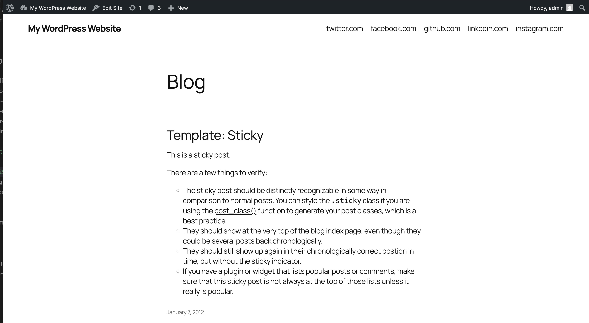

 

<h2>Use WPGraphQL to query WordPress</h2>

Example that loads WordPress with WPGraphQL active and defaults to the WPGraphQL IDE page to allow users to test GraphQL queries and explore the GraphQL Schema.

<small>By <a href="https://github.com/jasonbahl">@jasonbahl</a> • <a href="https://github.com/wordpress/blueprints/blob/trunk/blueprints/wpgraphql/blueprint.json">View source</a> • <a href="https://playground.wordpress.net/builder/builder.html?blueprint-url=https://raw.githubusercontent.com/wordpress/blueprints/1cb0a25b887ed9b7bfc983ee76cf0396dd2ba34d/blueprints/wpgraphql/blueprint.json">Edit</a></small>

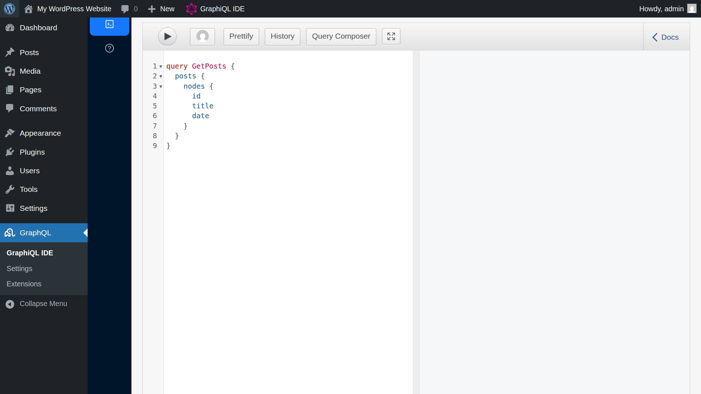

 

<h2>Use wp-cli command to add posts</h2>

Blueprint example to add posts via a wp-cli command.

<small>By <a href="https://github.com/bph">@bph</a> • <a href="https://github.com/wordpress/blueprints/blob/trunk/blueprints/posts-via-wp-cli/blueprint.json">View source</a> • <a href="https://playground.wordpress.net/builder/builder.html?blueprint-url=https://raw.githubusercontent.com/wordpress/blueprints/1cb0a25b887ed9b7bfc983ee76cf0396dd2ba34d/blueprints/posts-via-wp-cli/blueprint.json">Edit</a></small>

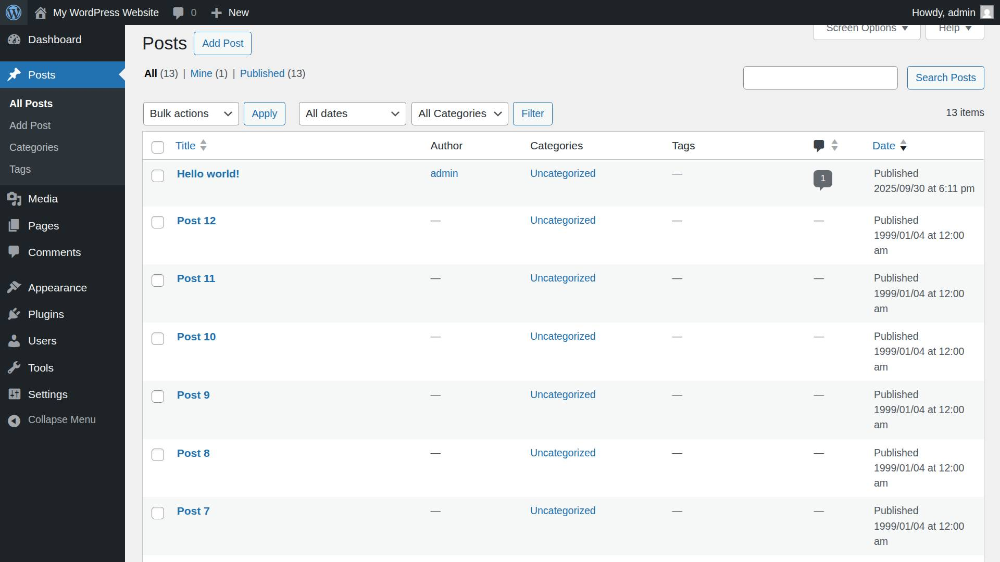

 

<h2>Use wp-cli to add a post with image</h2>

Use wp-cli to create a post from text file with block markup and a featured image

<small>By <a href="https://github.com/bph">@bph</a> • <a href="https://github.com/wordpress/blueprints/blob/trunk/blueprints/wpcli-post-with-image/blueprint.json">View source</a> • <a href="https://playground.wordpress.net/builder/builder.html?blueprint-url=https://raw.githubusercontent.com/wordpress/blueprints/1cb0a25b887ed9b7bfc983ee76cf0396dd2ba34d/blueprints/wpcli-post-with-image/blueprint.json">Edit</a></small>

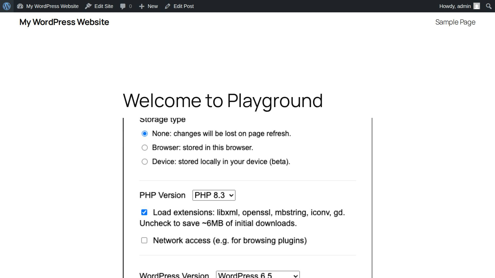

 

<h2>Weather Shortcode Plugin</h2>

A blueprint to connetc weather API and show data as shortcode on a WordPress site.

<small>By <a href="https://github.com/muryamsultana">@muryamsultana</a> • <a href="https://github.com/wordpress/blueprints/blob/trunk/blueprints/pwa-weather-app/blueprint.json">View source</a> • <a href="https://playground.wordpress.net/builder/builder.html?blueprint-url=https://raw.githubusercontent.com/wordpress/blueprints/1cb0a25b887ed9b7bfc983ee76cf0396dd2ba34d/blueprints/pwa-weather-app/blueprint.json">Edit</a></small>

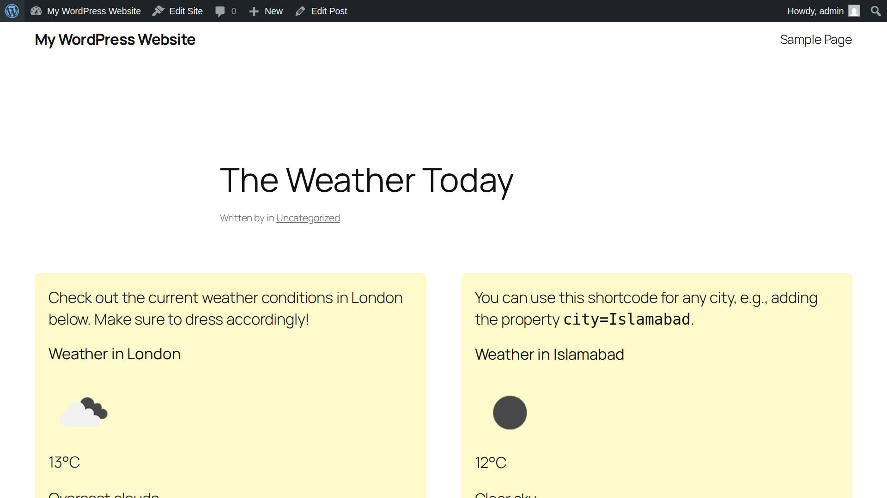

 

<h2>WooCommerce product feed</h2>

Blueprint to create a WooCommerce product and export an XML/CSV product feed

<small>By <a href="https://github.com/mujuonly">@mujuonly</a> • <a href="https://github.com/wordpress/blueprints/blob/trunk/blueprints/woocommerce-product-feed/blueprint.json">View source</a> • <a href="https://playground.wordpress.net/builder/builder.html?blueprint-url=https://raw.githubusercontent.com/wordpress/blueprints/1cb0a25b887ed9b7bfc983ee76cf0396dd2ba34d/blueprints/woocommerce-product-feed/blueprint.json">Edit</a></small>

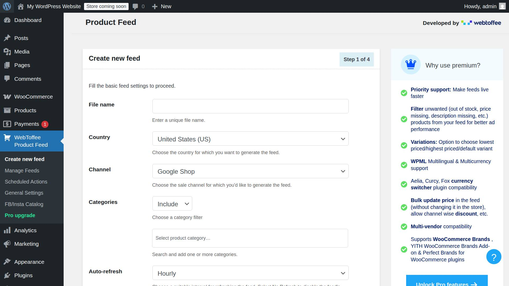

 

<h2>WordPress Beta</h2>

Test the latest WordPress Beta or RC release with theme test data and debugging plugins. Only loads the Beta version during the Beta period.

<small>By <a href="https://github.com/courtneyr-dev">@courtneyr-dev</a> • <a href="https://github.com/wordpress/blueprints/blob/trunk/blueprints/beta-rc/blueprint.json">View source</a> • <a href="https://playground.wordpress.net/builder/builder.html?blueprint-url=https://raw.githubusercontent.com/wordpress/blueprints/1cb0a25b887ed9b7bfc983ee76cf0396dd2ba34d/blueprints/beta-rc/blueprint.json">Edit</a></small>

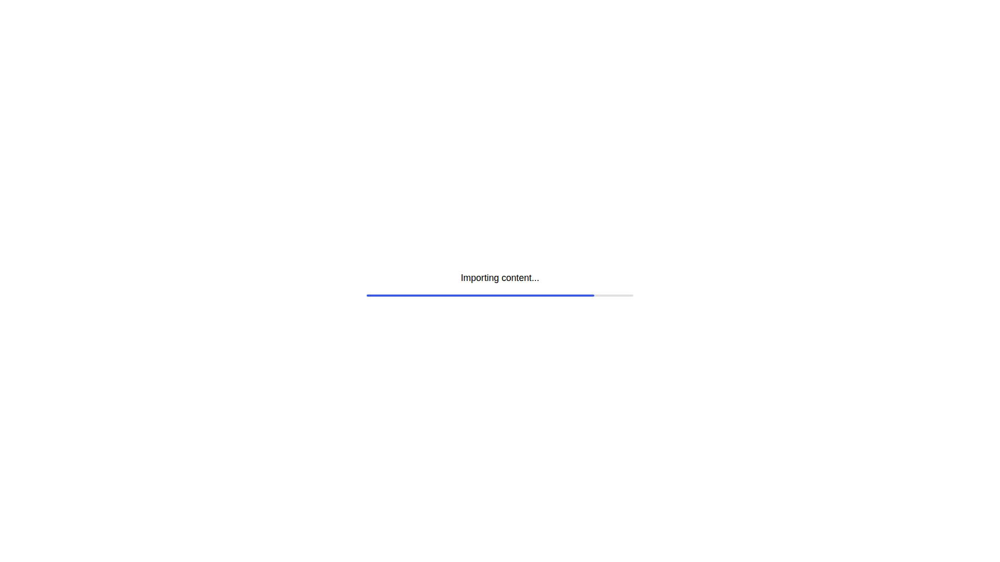

 

